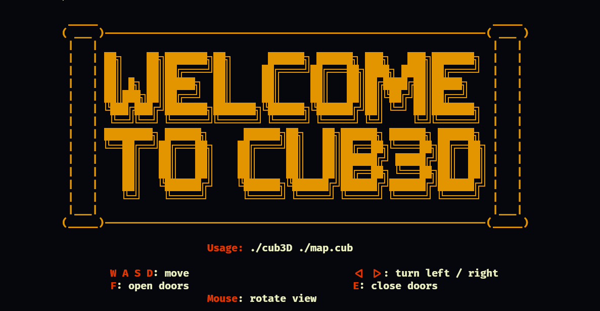
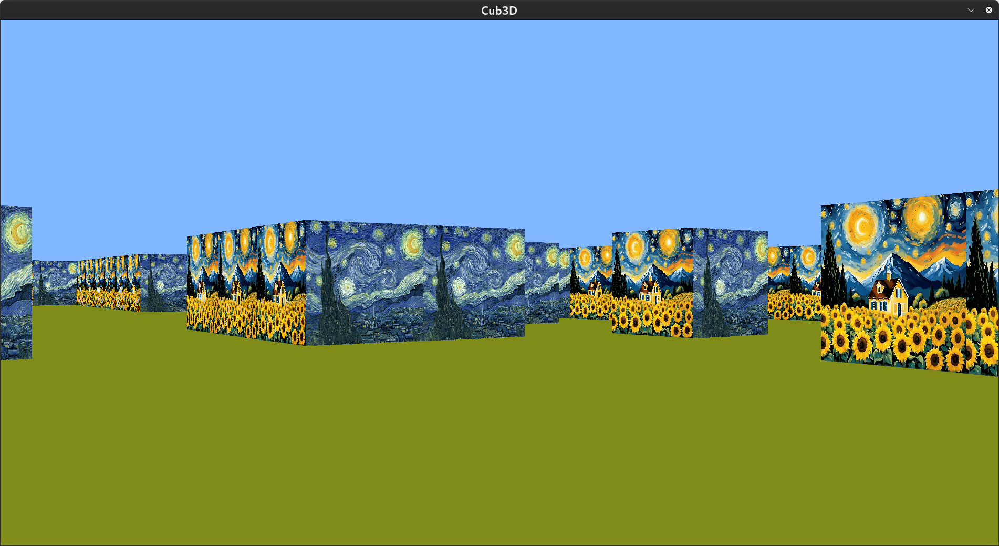
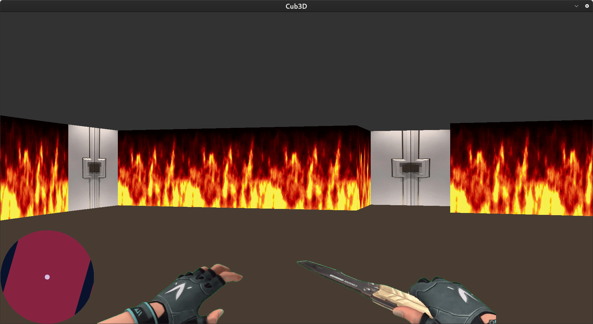
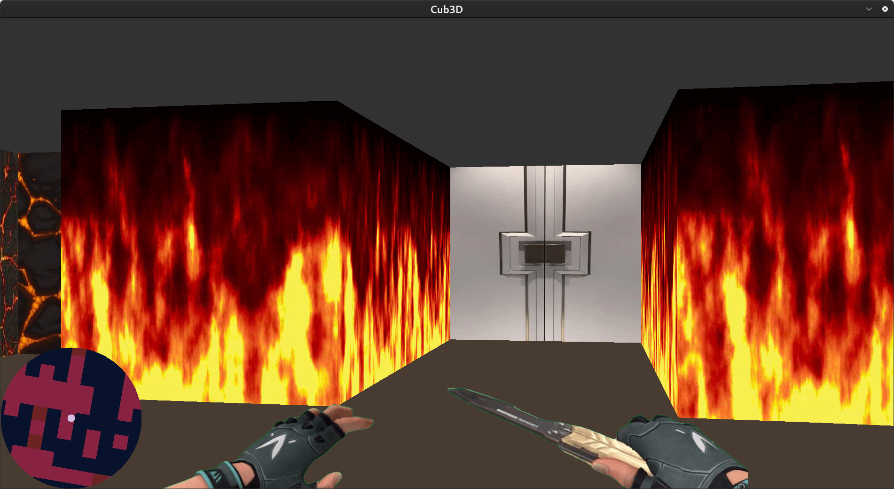
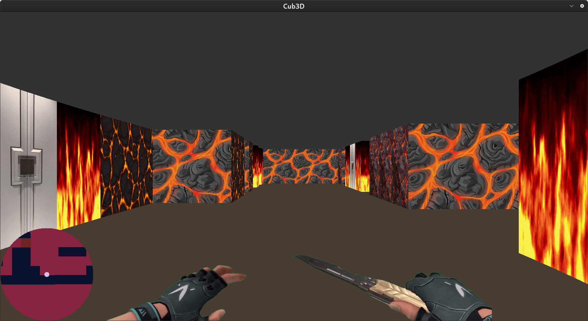
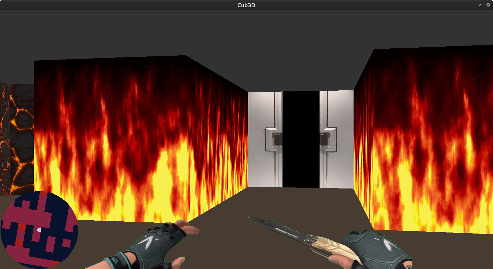

# cub3D

**A Raycasting-Based 3D Maze Explorer Inspired by Wolfenstein 3D**






---

## 🔍 Description
cub3D is a dynamic 3D maze navigation project that brings retro FPS gameplay to life using **raycasting technology**.
Developed in C with the MiniLibX graphics library, it transforms 2D map data into an immersive 3D environment where players explore mazes,
interact with doors, and navigate using a real-time rotating minimap. Originally inspired by Wolfenstein 3D.
This project demonstrates core principles of computer graphics and game development.

---

## 🎮 Key Features
- **GTA-Style Rotating Minimap**
  Dynamic overhead map rotates with player orientation for intuitive navigation.

- **Interactive Door System**
  Animated doors that open/close with smooth transitions.

- **Raycast Rendering Engine**
  Efficient 3D projection from 2D maps using the **DDA (Digital Differential Analyzer)** algorithm.

- **Fluid Controls**
  WASD movement, mouse/trackpad camera rotation, and real-time minimap rendering.

---

## 🛠️ Installation
**Tested on macOS/Linux**

1. **Clone Repository**
   ```bash
   git clone https://github.com/olaaroub/42_Cub3D.git cub3d && cd cub3D
   ```

2. **Install Dependencies**
   - MiniLibX (included) requires:
     gcc
     make
     X11 include files (package xorg)
     XShm extension must be present (package libxext-dev)
     ```Utility functions from BSD systems - development files (package libbsd-dev)
     sudo apt-get install libxext-dev libxrandr-dev libx11-dev libxml2-dev
     sudo apt-get install gcc make xorg libxext-dev libbsd-dev (Debian/Ubuntu)
     ```

3. **Compile**
   ```bash
   make  # Builds mandatory part
   make bonus # For the bonus part
   ```

---

## 🕹️ Usage
**Launch the Game**
```bash
./cub3D --help # For help menu
./cub3D maps/map.cub
```

**Controls**
|       Action          |       Key       |
|-----------------------|-----------------|
| Move                  | `W` `A` `S` `D` |
| Turn Left/Right       | Right/Left arrow|
| Rotate Camera         | Mouse/Trackpad  |
| Open/Close Doors      | `F`      `E`    |
| Quit                  | `ESC`           |

---

## 🧠 Skills Developed
Through this project, I mastered:
- **Raycasting Mathematics**: Converting 2D maps to 3D environments using angle calculations and grid traversal.
- **DDA Algorithm**: Efficiently determining wall intersections for raycasting optimization.
- **Dynamic Animation Systems**: Door states and motion effects managed via frame-based timing.
- **MiniLibX Graphics**: Low-level window/event management and pixel buffer manipulation.

---

## ⚙️ Technologies
- **C Programming**
- **MiniLibX** (Lightweight X-Window graphics library)
- **Raycasting/DDA Algorithm**
- **Unix System Programming**

---

## 🌟 Resources
* [**Wolfenstein 3D**](http://users.atw.hu/wolf3d/)
* [**Raycasting in JS**](http://www.playfuljs.com/a-first-person-engine-in-265-lines/)
* [**Raycasting theory from**](https://lodev.org/cgtutor/raycasting.html)
* [**Images in minilibx**](https://github.com/keuhdall/images_example)
```
